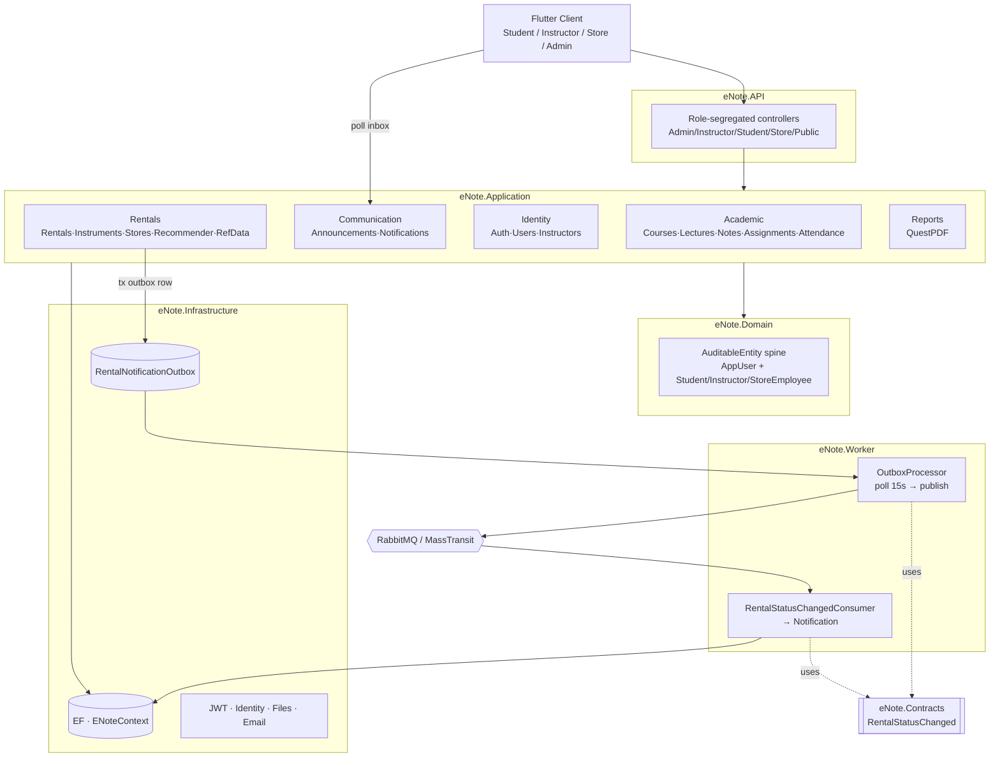

# eNoteV2 — Phase 1: Mental Model

**Generated**: 2026-06-28
**Method**: graphify dependency graph (1620 nodes / 3573 edges) + source verification
**Supersedes**: `eNote/architecture-review.md` (which described 4 of the ~12 real contexts)

> This is "here is what your application actually is." No critique here — that is Phase 2.
> Every claim below was verified against source, not the stale `.docs/blueprint` dumps.

---

## 1. What eNoteV2 actually is

A **music-school platform** with three human roles — **Student**, **Instructor**, **Store Employee** — plus an **Admin** surface. It does five things:

1. **Academic** — courses, enrollment, lectures, lecture notes, assignments, submissions, grading, attendance, per-course student ranking.
2. **Instrument rentals** — request → approve → pickup → complete/return-early, with a state machine, instrument locking, and prorated billing.
3. **Identity & access** — registration/login, JWT with revocation, password reset, role-segregated profiles, membership (paid-until) gating.
4. **Communication** — in-app announcements (course/store scoped) and a notification inbox fed by an **asynchronous event pipeline**.
5. **Recommendations** — a hybrid recommender that suggests instruments to rent.

Frontend is a **Flutter** multi-platform client. Backend is a **.NET modular monolith + a separate worker service**, Postgres/SQL Server via EF Core, RabbitMQ via MassTransit, packaged with Docker.

---

## 2. Solution topology — 7 projects, not 4

Your docs describe Clean Architecture's 4 layers. The solution actually has **7 projects**. The two your blueprint omitted are the most architecturally interesting:

| Project | Role |
|---|---|
| `eNote.API` | Presentation. Controllers, middleware, OpenAPI/Scalar, rate limiting, DI wiring, seeding. |
| `eNote.Application` | Use cases. Feature services, DTOs, validators, paging/search, state machine, billing, recommender. |
| `eNote.Domain` | Core. Entities, enums, base types. No dependencies. |
| `eNote.Infrastructure` | Adapters. EF `ENoteContext`, configurations, migrations, seed, Identity, JWT, file storage, messaging, email. |
| **`eNote.Worker`** | **Separate background process.** Polls the outbox, publishes to RabbitMQ, consumes events, writes notifications. Runs as its own container. |
| **`eNote.Contracts`** | **Shared message contracts** between API and Worker (`RentalStatusChanged` record). The integration-event boundary. |
| `eNote.Tests` | xUnit + EF InMemory. Billing, state machine, membership, validators. |

**This is not a pure monolith — it is a monolith + a worker, decoupled by a message contract.** That changes the whole async story (§6).

---

## 3. The real bounded-context map (~12, grouped by area)

graphify found these as distinct clusters; the folder tree confirms them. Grouped by the `Features/` top-level area:

### Academic (`Features/Academic`)
- **Courses** — `CourseService`, enrollment (`CourseEnrollmentService`), ranking (`RankingService`), PDF ranking report. Membership-gated enrollment.
- **Lectures** — `LectureService`, instructor-owned, cancel/soft-delete.
- **LectureNotes** — per-lecture notes, instructor-authored, student-readable.
- **Assignments** — `AssignmentService` + `AssignmentSubmissionService` (file upload, single submission, grading 0–100).
- **Attendance** — `Attendance` entity + `AttendanceStatus`, marked per lecture.

### Communication (`Features/Communication`)
- **Announcements** — course-scoped and store-scoped, with image upload. Three service interfaces (course/store/student views).
- **Notifications** — inbox: paged list, unread count, mark-read/all. **Populated only by the async pipeline, never written directly by a request.**

### Identity (`Features/Identity`)
- **Auth** — `AuthService` (Infrastructure): login (lockout), register, logout (JWT revocation), forgot/reset password.
- **Users** — profiles (`Student` / `Instructor` / `MusicStoreEmployee`), account management, provisioning, self-service.
- **Instructors** — `InstructorAccessService` (the ownership-enforcement hub) + admin instructor management.

### Rentals (`Features/Rentals`)
- **InstrumentRentals** — the richest context: `RentalCommandService` / `RentalQueryService` (CQRS split), `RentalStateMachine`, `RentalBilling`, notification dispatch.
- **Instruments** — catalog: public / student / store-scoped controllers, availability extensions, `InstrumentView` tracking (feeds the recommender).
- **MusicStores** — store entities + employee/store context resolution.
- **Recommendations** — `RecommendationService` (§7).
- **ReferenceData** — CRUD for Addresses, InstrumentTypes, MusicStores via a shared `ReferenceCrudController` / `ReferenceCrudService<T>` generic abstraction.

### Cross-cutting areas
- **Reports** (`Features/Reports`) — `ReportService` builds PDFs with QuestPDF (course ranking, store rental summary).
- **Files** (`Features/Files`) — `IFileStorageService` / `LocalFileStorageService`, uploads controller.

---

## 4. The domain-model spine

Everything hangs off two things — which is exactly why graphify flagged them as your top bridge nodes.

**`AuditableEntity` (the #1 cross-cutting node, bridges 14 clusters).** The inheritance root:
```
IEntity → BaseEntity (Id) → AuditableEntity (CreatedAt/UpdatedAt/CreatedById/UpdatedById)
```
Almost every entity extends it. That is why a change to it ripples everywhere — it is the structural seam of the whole system. (Whether that is a problem is a Phase 2 question.)

**The identity model.** `AppUser` (ASP.NET Identity) is the login. Three **profile** entities point at it by `AppUserId`:
- `Student` — owns `EnrollmentDate`, `MembershipPaidUntil`, and `HasActiveMembership(utcNow)`. This membership check gates enrollment **and** rental requests.
- `Instructor` — owns courses/lectures; ownership enforced via `InstructorAccessService`.
- `MusicStoreEmployee` — bound to a store; store context resolved per request.

`Student` is a hub: it collects `Enrollments`, `InstrumentRentals`, `AssignmentSubmissions`, `Attendances` — it is the join point between Academic and Rentals.

---

## 5. Synchronous request lifecycle (read/write)

```
Flutter ──HTTPS+JWT──▶ eNote.API
  │  rate limiting (auth) → JWT auth (signature, expiry, JTI-not-revoked)
  │  → [Authorize(Roles=…)] → model binding + DataAnnotations/FluentValidation
  ▼
Controller (role + route segregated: Admin/Instructor/Student/Store/Public)
  ▼
Application service
  │  resolve identity: ICurrentUserService → IUserContextResolver
  │                    → IInstructorAccessService / IMusicStoreContextService
  │  business rules + guard clauses (NotFound/Business/Authz/Conflict exceptions)
  │  persist via IAppDbContext (EF, async SaveChanges)
  │  Mapster → DTO
  ▼
ProblemDetails on error · camelCase JSON · _handleResponse() bubbles field errors
```

Role segregation is structural: each role gets its **own controller** per feature (`InstructorCourseController` vs `StudentCourseController`), not a shared controller with branching.

---

## 6. Asynchronous event flow — what your docs got wrong

Your `architecture-review.md` says "domain events written to outbox table → RabbitMQ publisher." The **real** mechanism is more specific and lives across the project boundary your docs ignored:

```
1. RentalCommandService does a rental transition, INSIDE one DB transaction:
     • saves the InstrumentRental change
     • IRentalNotificationDispatcher writes a RentalNotificationOutbox row
       (PayloadJson = serialized RentalStatusChanged, PublishedAt = null)
     → commit. (transactional outbox: state + intent committed atomically)

2. eNote.Worker · RentalNotificationOutboxProcessor (BackgroundService)
     • polls every 15s, batch of 20, PublishedAt == null, oldest first
     • deserializes → MassTransit IPublishEndpoint.Publish → RabbitMQ
     • stamps PublishedAt, or increments Attempts + records LastError on failure

3. eNote.Worker · RentalStatusChangedConsumer (IConsumer<RentalStatusChanged>)
     • dedups (same user + rental + title)
     • writes a Notification row

4. Student polls NotificationService (inbox, unread count, mark-read)
```

So it is **transactional outbox + polling publisher + broker + consumer + inbox**, spanning `Application` → `Infrastructure` → `Contracts` → `Worker`. Not EF domain events. This is the single biggest correction Phase 1 makes to your existing docs. (`NotificationPushDto` exists, suggesting a real-time push channel is planned/partial, but the persisted path above is what runs.)

---

## 7. The recommender (undocumented entirely)

`RecommendationService.GetRecommendedInstrumentsAsync` — a **hybrid recommender**, weighted:

| Signal | Weight | Source |
|---|---|---|
| Rental history (own preferred types + collaborative) | 0.40 | `InstrumentRental` history |
| Views | 0.30 | `InstrumentView` (tracked per user) |
| Similarity (manufacturer/type match) | 0.20 | preferred type + manufacturer |
| Popularity | 0.10 | global rental counts |

It does **collaborative filtering** ("students who rented what you rented also rented…"), builds an ~80-instrument candidate pool, scores, and returns localized (Bosnian) human-readable reasons per recommendation. This is the most algorithmically substantial code in the system and appears in **none** of your blueprint docs.

---

## 8. Patterns & conventions actually in use

- **Clean Architecture** (Domain has zero deps), **modular monolith + worker**.
- **CQRS** — only in InstrumentRentals (`Command`/`Query` split). Everywhere else: one service.
- **State machine** — `RentalStateMachine` with `TransitionDefinition` records, guards, actor-scoped transitions.
- **Transactional outbox** — `RentalNotificationOutbox` (§6).
- **Generic CRUD abstraction** — `ReferenceCrudController`/`ReferenceCrudService<TEntity,TDto,…>` for reference data.
- **Rich domain entities** — behavior on entities (`Approve`, `Pickup`, `HasActiveMembership`, `MarkRead`), private setters, protected ctors.
- **Mapster** DTO mapping, **FluentValidation** + DataAnnotations, **Mapster `IRegister`** per feature.
- **`IClock`** UTC abstraction (Ponytail Protocol), **soft delete** + global query filters, **audit fields** via `AuditableEntity`.
- **Role-segregated controllers** + ownership services (`InstructorAccessService`, `MusicStoreContextService`).
- **Naming**: `{Role}{Feature}Controller`, `I{Feature}Service`/`{Feature}Service`, `{Feature}Dto`/`{Feature}Request`/`{Feature}SearchObject`/`{Feature}SearchExtensions`. Consistent across the codebase.

---

## 9. What Phase 1 corrected vs your existing docs

| Your docs said | Reality |
|---|---|
| 4 bounded contexts | ~12 (Announcements, Notifications, Instruments, InstrumentTypes, MusicStores, Addresses, Attendance, LectureNotes, Recommendations, Reports were missing) |
| 4 projects | 7 (Worker + Contracts omitted) |
| "EF domain events → outbox" | Transactional outbox row + 15s polling worker + MassTransit + consumer |
| No recommender mentioned | Hybrid weighted recommender with collaborative filtering |
| No reporting mentioned | QuestPDF report service |
| Payments context "0 files" | Correct — still does not exist; rental billing is computed in-memory, never persisted |

---

## 10. System map



---

**Phase 1 done.** This is the corrected map your Phase 2 audit should run against — not the stale `.docs/blueprint` dumps. The graph (`graphify-out/graph.json`) is the queryable backing for it.
