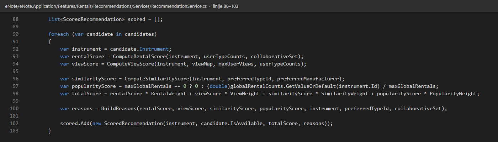
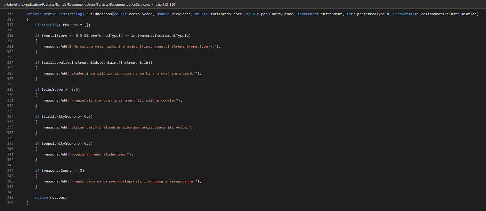
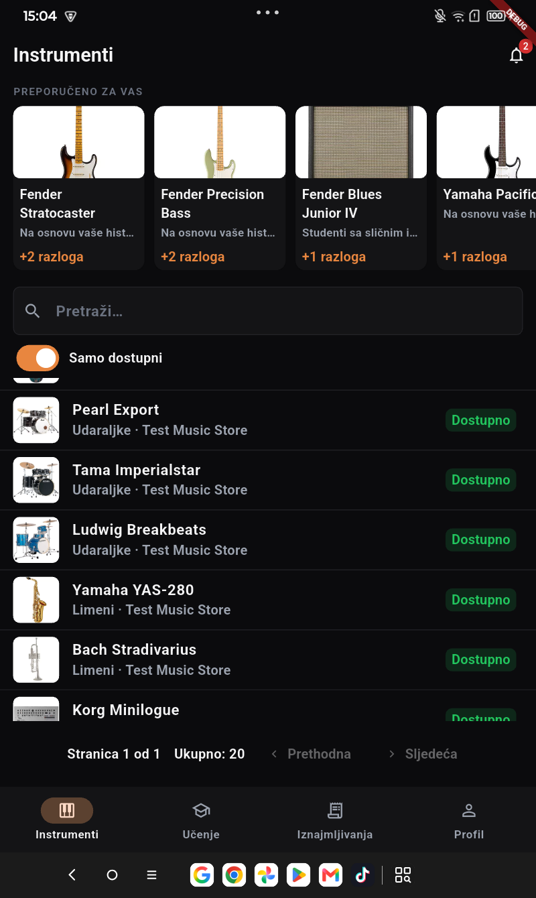
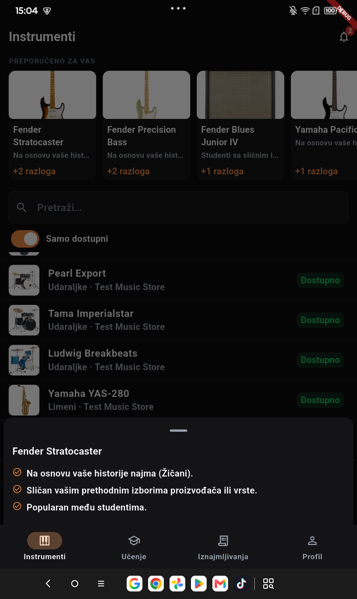

# Dokumentacija recommender sistema

eNote preporučuje studentu instrumente za najam. Preporuke se računaju iz podataka
koje aplikacija stvarno prikuplja: historije najma tog studenta, najmova ostalih
studenata, evidencije pregleda kataloga i ukupnog broja najmova po instrumentu.

## Gdje se nalazi kod

Servis: `eNote/eNote.Application/Features/Rentals/Recommendations/Services/RecommendationService.cs`

Kontroler: `eNote/eNote.API/Controllers/Instruments/InstrumentController.cs`

| Endpoint | Uloga | Šta radi |
|---|---|---|
| `GET /api/v1/student/instruments/recommended?count=5` | Student | Vraća listu preporuka sa skorom i objašnjenjima |
| `POST /api/v1/student/instruments/{id}/view` | Student | Evidentira pregled instrumenta u tabelu `InstrumentView` |

## Kako se računa skor

Ukupni skor je zbir četiri signala sa fiksnim težinama. Konstante su na vrhu
`RecommendationService`.

| Signal | Težina | Odakle dolazi |
|---|---|---|
| Najam | 0.40 | Vrste instrumenata koje je student već najmio, plus instrumenti koje biraju slični studenti |
| Pregledi | 0.30 | `InstrumentView` za tog korisnika, normalizovano po najvećem broju pregleda |
| Sličnost | 0.20 | Isti proizvođač daje 1.0, ista vrsta daje 0.6 |
| Popularnost | 0.10 | Broj najmova instrumenta (odobreni, aktivni, završeni i vraćeni prije roka), normalizovan po najnajmljenijem |

```
total = najam * 0.40 + pregledi * 0.30 + sličnost * 0.20 + popularnost * 0.10
```

Signal najma se dijeli još jednom. Kada student ima i vlastitu historiju i
poklapanje sa sličnim studentima, vlastita historija nosi 0.60 a kolaborativni
dio 0.40 (`OwnRentalHistoryWeight`, `CollaborativeRentalWeight`). Kada postoji
samo jedan od ta dva signala, uzima se veći od njih.

Kolaborativni dio radi u dva koraka u metodi `BuildCollaborativeInstrumentIdsAsync`.
Prvo se nađu studenti koji su najmili bar jedan isti instrument kao trenutni
student. Zatim se uzmu instrumenti koje su ti studenti najmili, a trenutni student
nije. Ti instrumenti ulaze u kandidate i dobijaju puni kolaborativni skor.

Ako student nije pregledao konkretan instrument, ali je taj instrument iste vrste
koju je ranije najmio, signal pregleda dobija vrijednost 0.35
(`TypeViewFallbackScore`) umjesto nule. Bez toga bi novi instrumenti u poznatoj
vrsti ispadali iz preporuka.

Instrumenti koje student trenutno drži u najmu (status `Approved` ili `Active`)
izbacuju se iz rezultata.

## Objašnjive preporuke

Svaka preporuka nosi listu razloga na bosanskom. Razlozi se grade u metodi
`BuildReasons` i svaki od njih je vezan za jedan signal koji je stvarno prešao svoj
prag:

| Uslov | Razlog koji se prikazuje |
|---|---|
| Skor najma >= 0.5 i vrsta se poklapa | "Na osnovu vaše historije najma (vrsta)." |
| Instrument je u kolaborativnom skupu | "Studenti sa sličnim izborima najma biraju ovaj instrument." |
| Skor pregleda >= 0.5 | "Pregledali ste ovaj instrument ili slične modele." |
| Skor sličnosti >= 0.6 | "Sličan vašim prethodnim izborima proizvođača ili vrste." |
| Skor popularnosti >= 0.5 | "Popularan među studentima." |
| Nijedan prag nije pređen | "Preporučeno na osnovu dostupnosti i ukupnog interesovanja." |

## Primjer odgovora

```json
{
  "instrument": { "id": 1, "model": "Stratocaster", "manufacturer": "Fender" },
  "score": 0.805,
  "reasons": [
    "Na osnovu vaše historije najma (Žičani).",
    "Sličan vašim prethodnim izborima proizvođača ili vrste.",
    "Popularan među studentima."
  ]
}
```

Odgovor je stvarni rezultat za seed nalog student.

## Podaci koje aplikacija prikuplja

| Podatak | Tabela | Kako se puni |
|---|---|---|
| Historija najma | `InstrumentRental` | Kroz rental workflow |
| Pregledi kataloga | `InstrumentView` | `POST /api/v1/student/instruments/{id}/view` |
| Popularnost | `InstrumentRental` | Agregacija postojećih najmova, jedan `GroupBy` upit |

Sva tri podatka ulaze u formulu iznad. Nema podataka koji se prikupljaju a zatim
ne koriste.

## Testovi

`eNote/eNote.Tests/Rentals/RecommendationServiceTests.cs`

## Glavna logika u kodu

`eNote/eNote.Application/Features/Rentals/Recommendations/Services/RecommendationService.cs`

Petlja koja računa četiri signala i ukupni skor (linije 88–103):



Metoda BuildReasons, koja gradi objašnjenja (linije 315–350):



## Preporuke u aplikaciji

- `UI/enote_mobile/lib/features/instruments/instrument_catalog_screen.dart`
- `UI/enote_mobile/lib/features/instruments/recommendation_strip.dart`

Mobilna aplikacija, tab Instrumenti, prijavljen student:



Dugme "+N razloga" otvara sva objašnjenja jedne preporuke:


